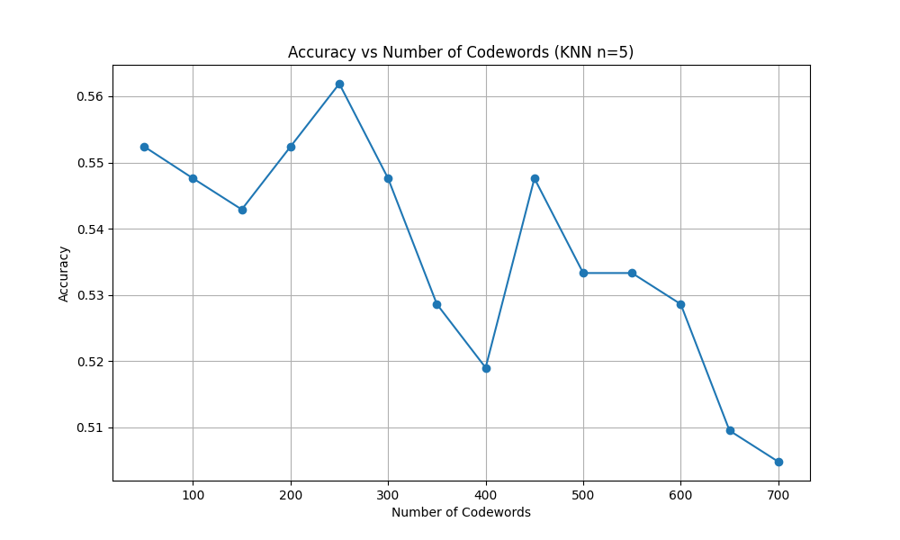
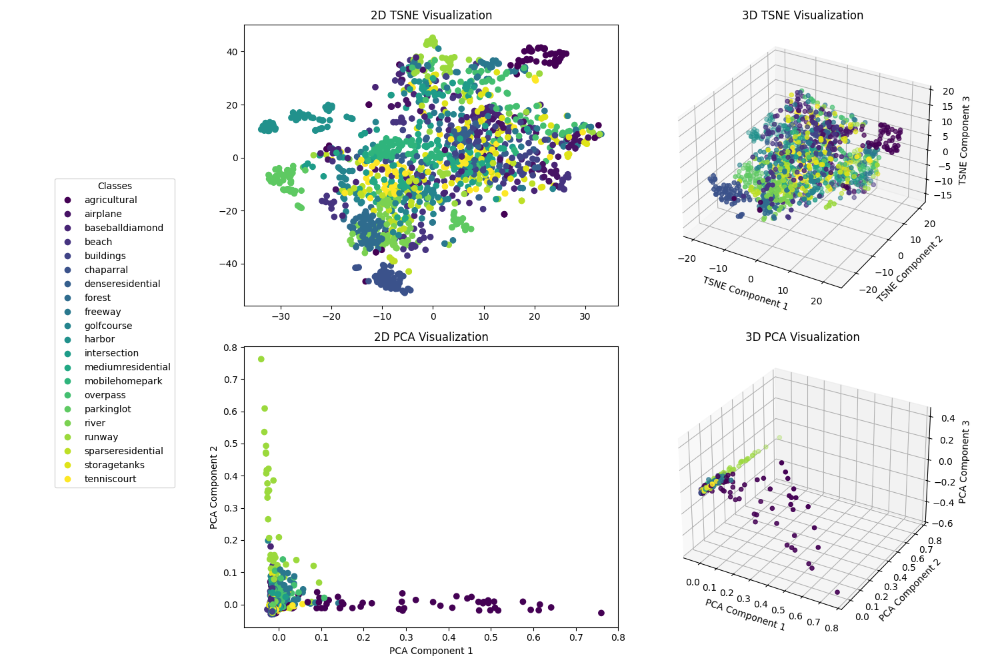

# Assignment 1

Dataset: https://vincmazet.github.io/bip/detection/edges.html

## Validation Accuracies:

#### KNN(n=5)

| Codewords | Accuracy |
| --------- | -------- |
| 50        | 0.5524   |
| 100       | 0.5476   |
| 150       | 0.5429   |
| 200       | 0.5524   |
| 250       | 0.5619   |
| 300       | 0.5476   |
| 350       | 0.5286   |
| 400       | 0.5190   |
| 450       | 0.5476   |
| 500       | 0.5333   |
| 550       | 0.5333   |
| 600       | 0.5286   |
| 650       | 0.5095   |
| 700       | 0.5048   |

#### Best Model

K = 250 and n = 5

## Testing Accuracy

| Codewords | Accuracy |
| --------- | -------- |
| 50        | 0.5857   |
| 250       | 0.5214   |

#### Best Model

K = 50 and n = 5

## Analysis

### Classification Accuracy

The classification accuracy was tested with two different K-NN configurations (n=21 and n=5) across various numbers of codewords. The best performance was achieved with K=250 and n=5, yielding a validation accuracy of approximately 56.19%.

However, during testing phase, it was noticed that the model with K=50 outperformed the model with K=250 by a significant margin!

### Accuracy vs Number of Codewords

The graph shows how classification accuracy varies with different numbers of codewords. We observe that:

- Initial performance improves as codewords increase up to 250
- Performance generally degrades with more than 250 codewords

### t-SNE & PCA Visualization

The t-SNE and PCA visualizations of SIFT keypoints (128-dimensional):

