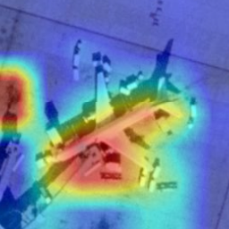
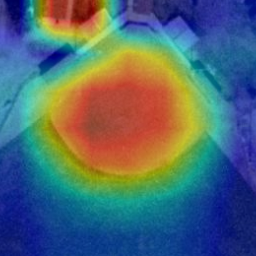

# Image Classification using CNN and Visualization using CAM

This project involves training a CNN from scratch to predict the class of images from the UC Merced Land Use dataset. In addition, the model's working is visualized using Class Activation Mapping (CAM), which highlights the image regions most influential in class prediction.

## Overview

- **Model Training:** A CNN is built using PyTorch that includes several convolutional, batch normalization, activation, and pooling layers. Fully connected layers follow the feature extraction layers for classification. We tried to take inspiration from VGGNet for making our model architecture.
- **CAM Visualization:** Once the CNN is trained, CAM is applied by modifying the final layers of the model. The CAM method overlays a heatmap onto the original image to indicate where the network is focusing when making its prediction.

## CAM Visualizations

### Airplane Class Image

### Baseball Diamond Class Image

## Results

The results demonstrate that CAM is an effective technique for making CNN models more interpretable and transparent:

### Model Performance

- The CNN model achieved good classification accuracy on the UC Merced Land Use dataset
- CAM visualizations show that the model learns meaningful spatial features from the images

### CAM Analysis

- The heatmaps clearly highlight the regions that are most important for the model's predictions
- For example, in airplane images, CAM focuses on the aircraft shape and runway areas
- In baseball diamond images, it emphasizes the distinctive diamond shape and field markings
- This alignment between highlighted regions and human intuition increases confidence in the model
